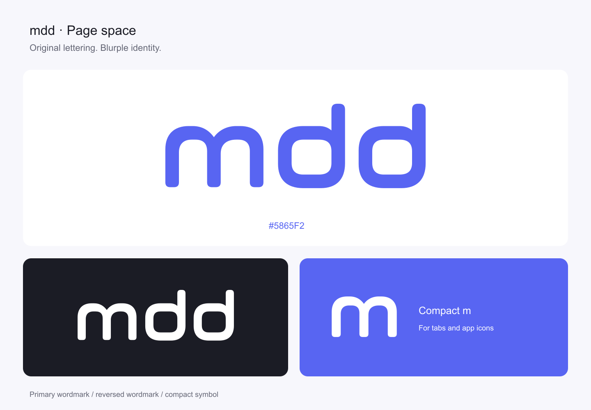

# MDD brand assets

**Page space** is MDD's selected logo: a friendly, custom-drawn lowercase `mdd` with rounded document-like spaces inside the two `d`s. Use the original lettering without the explored OK-hand additions.

## Choose a file

| Use | Asset |
| --- | --- |
| Documentation header, README, or other first introduction | `logo/mdd-wordmark-blurple.svg` or `logo/mdd-wordmark-black.svg` |
| Dark or blurple background | `logo/mdd-wordmark-white.svg` |
| A taller layout with room for a lockup | `logo/mdd-stacked-{black,white,blurple}.svg` |
| Small avatar or a context where MDD is already named | `logo/mdd-symbol-{black,white,blurple}.svg` |
| Browser tab | `icons/favicon.svg`, `icons/favicon.ico`, or the 16/32/48 px favicon PNGs |
| App or home-screen icon | `icons/app-icon.svg`, `icons/apple-touch-icon.png`, or the supplied 192/512 px icons |
| A tool that cannot use SVG | Corresponding transparent exports in `png/` |

The wordmark is the primary identifier. Its first `m` supplies the compact symbol; that symbol does not replace the full `mdd` name in introductions. Keep the wordmark on one line, including within stacked lockups.

`source/mdd-wordmark.svg` preserves the selected black master. `source/mdd-symbol.svg` contains the derived compact artwork. Wordmark PNGs are 1200 px wide; symbol and stacked PNGs are 512 px. Use vector files whenever possible and avoid enlarging PNGs beyond their exported dimensions.

## Space and size

Leave at least one stem width of clear space around the visible artwork. In the wordmark's 600 × 256 coordinate system, this unit is **28**; scale the clearance with the mark. At a 120 px SVG width, one unit equals 5.6 px. Count the existing transparent margins toward that clearance.

Use the complete wordmark at **96 px wide or larger** as a practical screen starting point. Use the supplied favicon artwork at **16–48 px** instead of squeezing all three letters into a tab icon. For print, proof the mark at its intended physical size; no print minimum has been approved.

The white exports use a 98% optical scale within the same canvas to temper the apparent weight on dark backgrounds. They retain the original letterforms; do not adjust their spacing separately.

## Colour

| Colour | HEX | RGB | Use |
| --- | --- | --- | --- |
| Blurple | `#5865F2` | 88, 101, 242 | Primary brand colour |
| Black | `#000000` | 0, 0, 0 | One-colour mark on light backgrounds |
| White | `#FFFFFF` | 255, 255, 255 | Reversed mark and light background |
| Dark neutral | `#1B1C25` | 27, 28, 37 | Dark background |

The selected blurple value follows [Discord's official colour reference](https://discord.com/branding). MDD uses its own Page space artwork.

Use blurple or black on white, and white on blurple or the dark neutral. Place the mark on a quiet, solid surface when a photograph or pattern would obscure it. The reader's earlier green theme does not define this brand palette.

These are RGB digital masters. CMYK conversions and Pantone matches require a printer's proof and are not specified here.

## Lettering and handling

The logo consists of custom vector paths, not a font. No font files are included or required to render it. Supporting copy may use the reader's existing system font stack; do not recreate the wordmark by typing `mdd`.

- Preserve the proportions, spacing, rounded corners, and open counters.
- Use the supplied colour variants and lockups.
- Keep the mark upright and free of shadows, gradients, outlines, extra strokes, and gestures.
- Give meaningful logo images an accessible name such as `MDD`; use empty alternative text when adjacent text already supplies that name.

## Web assets and previews

`icons/head-snippet.html` and `icons/site.webmanifest` are reusable integration examples. When using them on another site, copy the referenced files into the served output and adapt their URLs, scope, and start URL to that site's base path. A manifest and icons alone do not enable PWA behaviour. The maskable icon is a separate file with its own safe padding.

`preview/overview.png`, `preview/validation.png`, and `preview/presentation.html` document the artwork and show design contexts. Mockups are illustrative, not screenshots proving a live application change or deployment.

The repository's [MIT licence](../LICENSE) remains applicable. This guide makes no trademark-clearance claim; a professional trademark and similarity search remains pending before formal registration or a wider identity launch.
